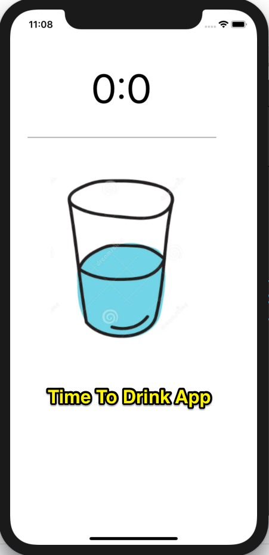

# Ứng dụng nhắc uống nước

Bài tập mở rộng

1. Hãy bổ xung chức năng Autolayout
2. Cho phép người dùng có thể cấu hình khoảng thời gian theo phút để 
nhắc
3. Ngoài nhắc uống nước bổ xung nhắc đi ra ngoài
4. Khi đến giờ cần rung cả thiết bị di động và phát tiếng kêu
